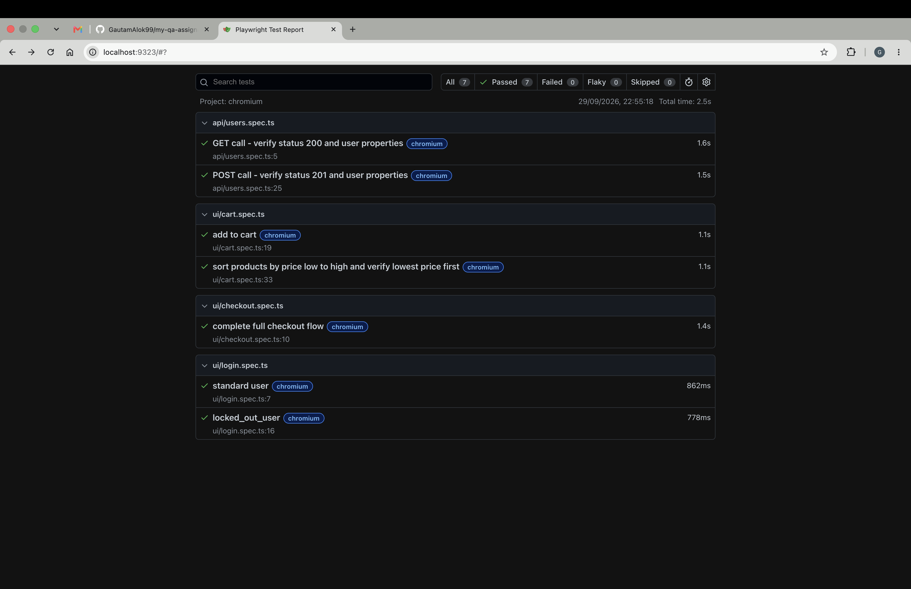

# Playwright Automation Suite

As per the assignment provided i have created a UI and API test automation suite using Playwright (TypeScript).

Below are the steps to run those test scripts, considering following prerequisites already availabe on machine Node.js (v18 or higher) and npm.

## Installation 

1. Install dependencies:
npm install

2. Install Playwright browser binaries:
npx playwright install

## Running Tests

Run all tests:
npx playwright test

Run tests in headed mode:
npx playwright test --headed

Run a specific test file:
npx playwright test login.spec.ts
npx playwright test cart.spec.ts
npx playwright test checkout.spec.ts
npx playwright test users.spec.ts

View the HTML test report:
npx playwright show-report

## Suite Overview

### 1. UI Tests (tests/ui) - Target: SauceDemo

Uses the Page Object Model (POM) pattern with page objects in `pages/`, test data in `test-data/`, and locators in `Utils/`.

- `login.spec.ts`:
  - Positive login test with standard user credentials.
  - Negative login test with locked-out user verifying the error alert message.

- `cart.spec.ts`:
  - Adds items to the cart and validates the cart badge counter.
  - Sorts products by price (low to high) and verifies the first item has the lowest price.

- `checkout.spec.ts`:
  - Complete checkout flow: login, add items to cart, enter checkout information, verify summary, finish order, and assert order confirmation message.

### 2. API Tests (tests/api) - Target: ReqRes

Uses Playwright's `request` fixture to test REST API endpoints.

- `users.spec.ts`:
  - `GET /api/users?page=2`: Verifies HTTP status 200, checks that the response contains a `data` array, and verifies that each user object contains `id`, `email`, `first_name`, and `last_name`.
  - `POST /api/users`: Sends user payload (`name`, `job`), verifies HTTP status 201, and checks that the response echoes `name` and `job` with an `id` and `createdAt` timestamp.

Comments are also added in scripts for better understanding of the code.

All test script passed , result image added below : 

